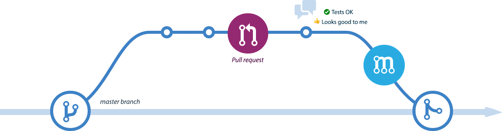

# Feature Delivery Workflow (FDW)

Afinal, o que são fluxos de trabalho Git (**Git Workflow**)?

O conjunto de definições que estipulam regras para criação, remoção, origem e destino de ramificações(**branches**) dentro do **Git**, definem um fluxo de trabalho(**workflow**).

Assim como Padrões de projeto (**Design patterns**), existem vários tipos de fluxo de trabalho para trabalhar com o Git. Cada fluxo é destinado a cenários que se encaixem na necessidade do time e do projeto.

## Sobre

O fluxo **Feature Delivery Workflow (FDW)** foi criado para atender cenários que exigem constante geração de pequenos blocos de artefatos que compõe blocos maiores de entregáveis, permitindo entregas sob demanda.

Sua premissa é permitir entregar **somente o que já foi homologado** pelo cliente, evitando a geração de grandes pacotes para homologação e facilitando integração com ferramentas de **Continuous Delivery**(CD).

O fluxo **FDW** possui alguns pontos em comum com o **Gitflow Workflow**. Entre suas principais diferenças, no fluxo FDW existe uma branch chamada `homolog` voltada para a homologação de features que serão entregues, não existindo a necessidade da branch `release`.

A representação do workflow **FDW** pode ser visualizada da seguinte maneira:

## Merge Request (MR)

Merge Request, representado pela sigla **MR**, significa **solicitação de mesclagem**.Essa nomenclatura, também conhecida como **Pull Request** por usuários do Github, é utilizada para registrar a intenção de **fusão** de uma branch de **origem** para uma branch de **destino**. Nessa etapa são realizadas avaliações do código-fonte, chamadas de **Code Review**.

Características:

- É recomendável que o Merge request seja revisado por uma pessoa diferente da que o abriu.
- Para ter mais controle, permitir maior nivelamento e interação entre membros do time, as branches `develop` e `master` só devem aceitar novos **commits** através de um **Code Review** após a abertura do **Merge Requests**.

## Develop

A branch `develop` significa **development** e representa algo que está em desenvolvimento.

Suas características são:

- Branch mais atual do projeto
- Utilizada como referência para geração de branches `feature` e `homolog`
- Só aceita novos commits através de um **Merge Requests**
- Representa o ambiente de produção contendo features mais recentes.

## Features

Funcionalidades são representadas por branches `feature`. Elas apresentam as seguintes características:

- Novas features devem ser criadas à partir da branch `develop`
- Sempre que for feito um novo **Merge Request** destinado à branch `develop` ou `homolog`, **deve** ser feito um merge da branch `develop` para a branch `feature`
- Sempre que o desenvolvimento de uma feature for concluído ela deve ser enviada para a branch `homolog` através de um merge
- Assim que uma feature é validada dentro da branch `homolog`, deve ser feito um novo merge da branch `develop` para a feature, garantindo que não existam conflitos ao unir a `feature` com a branch `develop` através do **Merge Request**.

## Homolog

Homolog é uma abreviação para `homologation`. A branch `homolog` está destinada a simular o ambiente de produção, simulando propositalmente eventuais erros que poderiam ser gerados durante a entrega de features.

Suas características são:

- A branch `homolog` **NUNCA** deve ser movida ou deve ser utilizada como referência para ser criadas novas branches
- Merges através de **Merge Request** são opcionais variando de acordo com a necessidade do projeto

## Master

Essa branch é criada como padrão pelo Git. É considerada a principal branch do projeto principalmente por representar a versão estável do repositório.

Suas características são:

- Representa o ambiente de produção da aplicação.
- Utilizada como referência para geração de branches `hotfix`
- **Tags** e **Releases** são sempre gerados nesta branch.

## Hotfix

Hotfix significam **consertos rápidos** e representa algo que precisa ser ajustado com urgência. Esses ajustes podem ser classificados como pequenas correções ou pequenas alterações.

Suas características são:

- Criada sempre à partir da branch `master`
- Sempre que o desenvolvimento do hotfix é concluído, é necessário fazer um Merge na branch `homolog`. Caso o código seja validado com sucesso, devem ser criados **dois** Merge Requests, o primeiro para a branch `master` e o segundo para a branch `develop` 

## Geração de Tags / Releases

As **Tags** representam o registro de um marco dentro do projeto. As **releases** tem como responsabilidade trazer quais foram os envolvidos.

No fluxo FWD os itens que compõe entregáveis estão descritos nos Merge Requests.

A geração de Releases é composta pela criação do **Changelog** contendo itens que foram realizados e criação de Tags versionando o código-fonte utilizando o **Semantic versioning**.

**OBS:** As Releases são geradas somente à partir da branch `master`.

## :handshake: Contribuindo

 * Se você perceber que algo esta errado, [abra uma issue no GitHub](https://github.com/coopersystem-fsd/feature-delivery-workflow/issues/new/choose).

 * Você mesmo pode consertar, simplesmente [edite o arquivo no GitHub](https://github.com/php-df/vagas/edit/master/Readme.MD) e abra um novo pull request. O repositório será atualizado assim que o seu pull request for aceito!

:octocat: :smiley: :zap:

## Referências

- [Utilizando o fluxo Git Flow](https://medium.com/trainingcenter/utilizando-o-fluxo-git-flow-e63d5e0d5e04)
- [Comparando fluxos de trabalho](https://www.atlassian.com/br/git/tutorials/comparing-workflows)
- [Gitflow Workflow](https://www.atlassian.com/git/tutorials/comparing-workflows/gitflow-workflow)
- [Feate Branch Workflow](https://www.atlassian.com/git/tutorials/comparing-workflows/feature-branch-workflow)
- [Gitflow Workflow](https://imasters.com.br/desenvolvimento/quatro-workflows-para-trabalhar-com-git-melhores-2013)
- [Github Workflow](http://scottchacon.com/2011/08/31/github-flow.html)
- [Gitlab Workflow](https://about.gitlab.com/blog/2014/09/29/gitlab-flow)
- [Semantic versioning with Git tags](https://travishorn.com/semantic-versioning-with-git-tags-1ef2d4aeede6)
- [Gitmoji Commit Messages](https://gitmoji.carloscuesta.me) 
